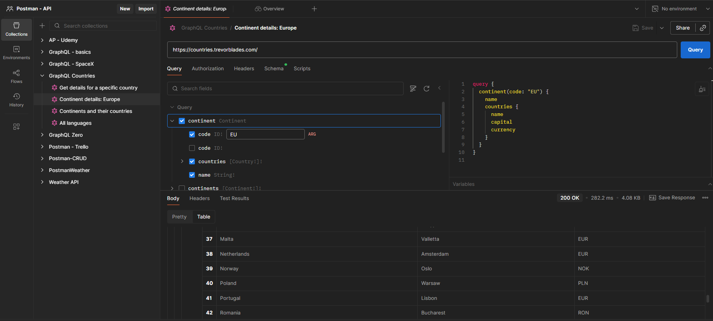

# GraphQL Countries API – Postman Collection

This document contains a structured summary of a series of requests sent to the public GraphQL API available at [https://countries.trevorblades.com/](https://countries.trevorblades.com/). The requests were created in Postman using the **GraphQL template**. Each request retrieves different types of geographical and linguistic data, and their corresponding results are illustrated below.

---

## 1. Get details for a specific country

This query retrieves full information about a specific country, identified by its ISO code. In this example, we used `"RO"` for Romania. The request returns:
- country name
- native name
- capital city
- flag emoji
- currency
- international calling code
- the continent the country belongs to

✅ This type of request is useful when you want detailed information for a single country.

**Query**
```graphql
query {
  country(code: "RO") {
    name
    native
    capital
    emoji
    currency
    phone
    continent {
      name
    }
  }
}
```

📸 

---

## 2. Continent details: Europe

This query retrieves information about the continent **Europe**, identified by the code `"EU"`. For each country in Europe, it returns:
- country name
- capital city
- currency

✅ This is useful when you're interested in exploring the countries within a specific continent.

**Query**
```graphql
query {
  continent(code: "EU") {
    name
    countries {
      name
      capital
      currency
    }
  }
}
```

📸 

---

## 3. Continents and their countries

This query returns all continents available in the API and, for each, lists all the countries that belong to it. The result includes:
- continent name
- country name
- country code

✅ This is a great way to get an overview of the global structure of continents and their corresponding countries.

**Query**
```graphql
query {
  continents {
    name
    countries {
      name
      code
    }
  }
}
```

📸 

---

## 4. All languages

This query retrieves a full list of languages defined in the dataset. For each language, it includes:
- ISO code
- English name
- native name

✅ Use this when you need a reference for all available languages, their names, and how they're written natively.

**Query**
```graphql
query {
  languages {
    code
    name
    native
  }
}
```

📸 