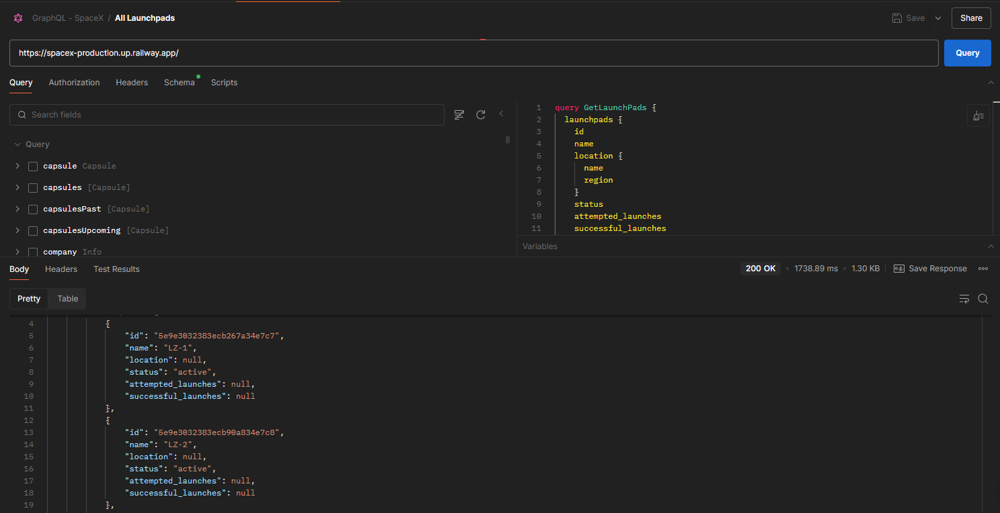
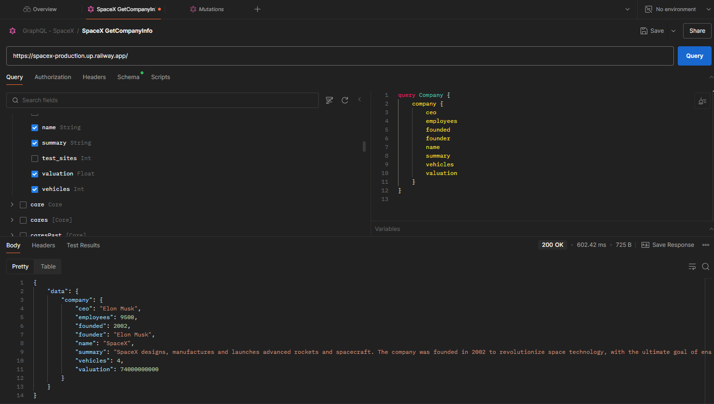
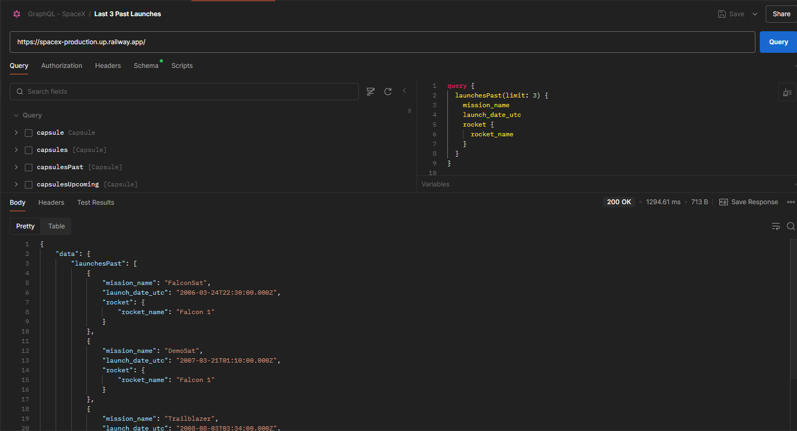
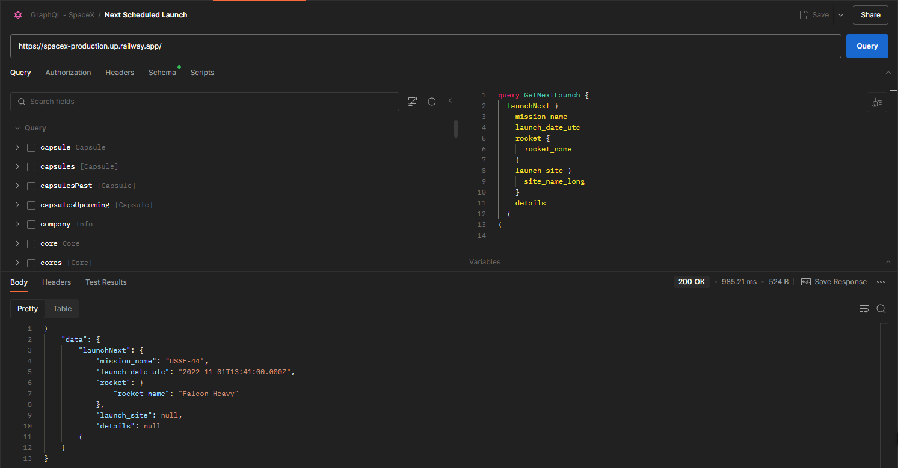

## SpaceX GraphQL Queries Documentation

### 1. Get All Launchpads

This query retrieves all available launchpads used by SpaceX, including their ID, name, location (region and name), current operational status, and the number of attempted and successful launches.

```graphql
query GetLaunchPads {
  launchpads {
    id
    name
    location {
      name
      region
    }
    status
    attempted_launches
    successful_launches
  }
}
```

📸 Screenshot: 

---

### 2. Get Company Info

This query fetches details about SpaceX company, such as the CEO's name, number of employees, year founded, founder, company name, summary of the company’s purpose, vehicles owned, and its valuation.

```graphql
query Company {
  company {
    ceo
    employees
    founded
    founder
    name
    summary
    vehicles
    valuation
  }
}
```

📸 Screenshot: 

---

### 3. Get Last 3 Past Launches

This query is used to fetch data about the last 3 past launches by SpaceX, including mission name, launch date (UTC format), and the rocket name used for each mission.

```graphql
query {
  launchesPast(limit: 3) {
    mission_name
    launch_date_utc
    rocket {
      rocket_name
    }
  }
}
```

📸 Screenshot: 

---

### 4. Get Next Scheduled Launch

This query shows the next planned launch by SpaceX. It provides mission name, launch date, rocket name, launch site name, and any available details about the mission.

```graphql
query GetNextLaunch {
  launchNext {
    mission_name
    launch_date_utc
    rocket {
      rocket_name
    }
    launch_site {
      site_name_long
    }
    details
  }
}
```

📸 Screenshot: 

---

> All queries were tested using [SpaceX GraphQL API](https://studio.apollographql.com/public/SpaceX-pxxbxen/variant/current/home) and executed in Postman using the GraphQL interface.
