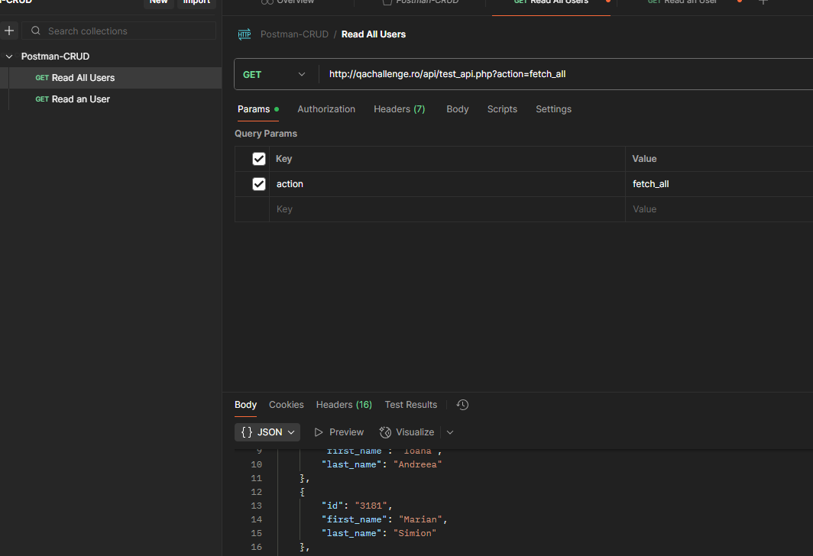
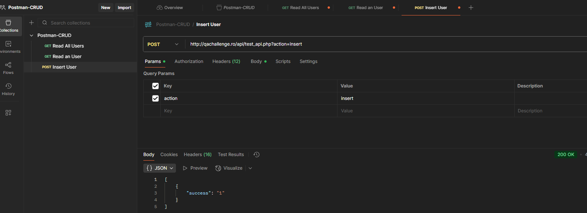
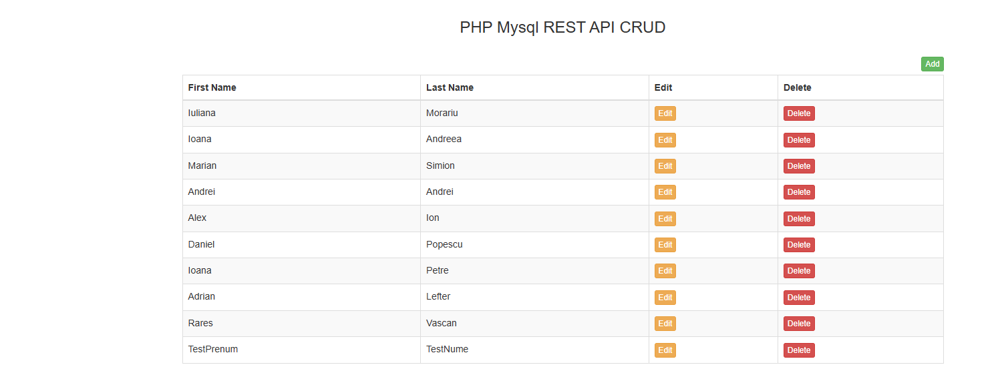
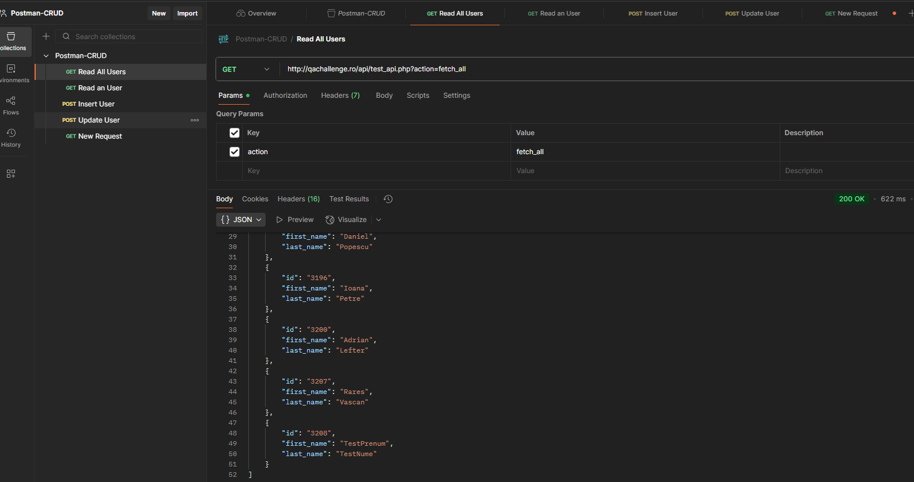
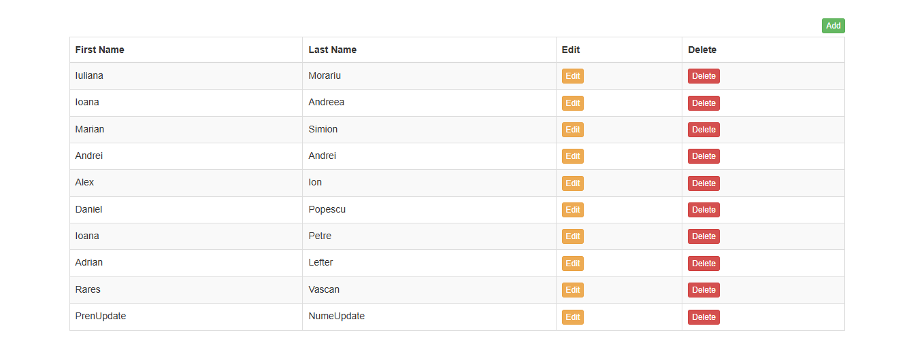
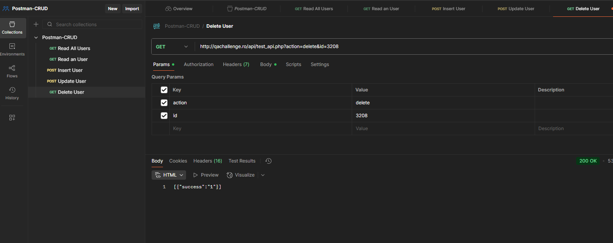
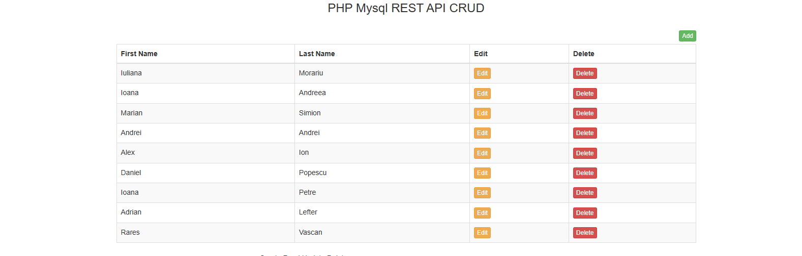
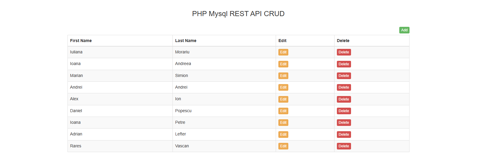

# Postman-CRUD

This project demonstrates how to perform CRUD operations (Create, Read, Update, Delete) using Postman and a REST API endpoint available at:

Test PHP API endpoint: [https://qachallenge.ro/api/test_api.php](https://qachallenge.ro/api/test_api.php)

Each operation is configured as a request in the `Postman-CRUD` collection.

## Requests Overview

### 1. Read All Users
Sends a `GET` request to retrieve all users from the database.

**URL:**
```
https://qachallenge.ro/api/test_api.php?action=fetch_all
```

### 🖼 Screenshot


---

### 2. Read a Single User
Sends a `GET` request using a specific `id` to fetch a single user's details.

**URL:**
```
https://qachallenge.ro/api/test_api.php?action=fetch_single&id=USER_ID
```

### 🖼 Screenshot Postman


### 🖼 Screenshot PHP logic


---

### 3. Insert User
Sends a `POST` request to insert a new user into the database.

**Body:**
- `action`: insert  
- `first_name`: user's first name  
- `last_name`: user's last name  

### 🖼 Screenshot Postman


### 🖼 Screenshot PHP logic


---

### 4. Update User
Sends a `POST` request to update an existing user's information.

**Body:**
- `action`: update  
- `id`: user's ID  
- `first_name`: new first name  
- `last_name`: new last name  

### 🖼 Screenshot Postman


### 🖼 Screenshot PHP logic


---

### 5. Delete User
Sends a `POST` request to delete a user by ID.

**Body:**
- `action`: delete  
- `id`: user's ID  

### 🖼 Screenshot Postman


### 🖼 Screenshot PHP logic


---

## Tools Used

- **Postman** for testing API requests  
- **PHP & MySQL** for back-end REST API functionality

## 🖼 Screenshot

