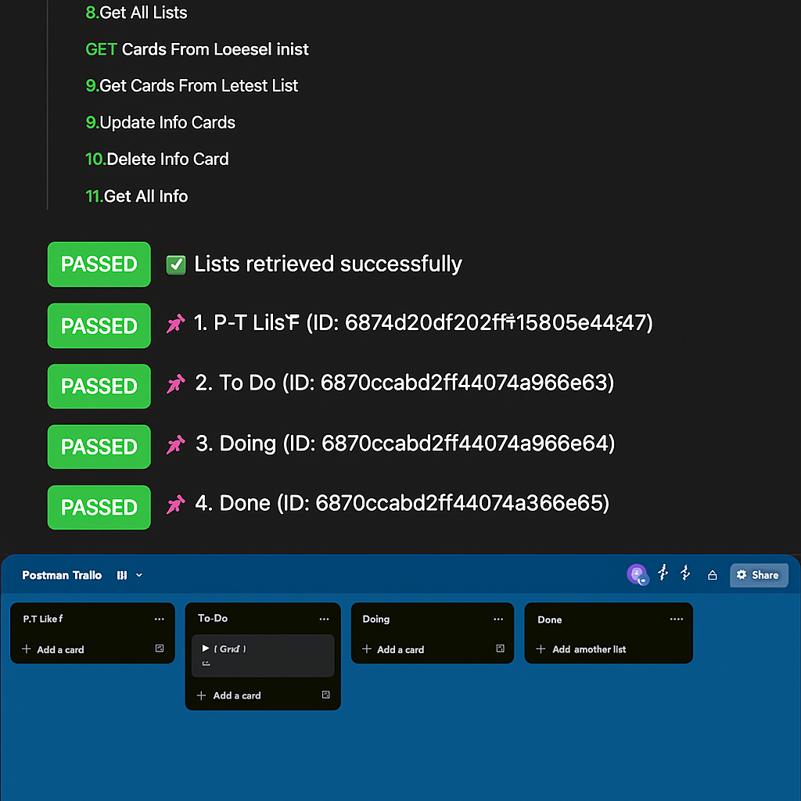

# 📌 13. Get All Lists from Board

This request retrieves all the visible (non-archived) lists from the active board. It is helpful for identifying the names and IDs of the available lists before creating or managing cards within them.

> ✅ This step is typically preceded by board creation or selection.

---

## 📥 Request Method

`GET https://api.trello.com/1/boards/{{boardId}}/lists`

---

## 🔐 Required Variables

- `key`: Your Trello API key
- `token`: Your Trello token
- `boardId`: ID of the board from which to get lists

---

## 🧪 Tests

```javascript
// Parse response
let lists = pm.response.json();

// ✅ Validate response is array
pm.test("✅ Lists retrieved", () => {
    pm.expect(Array.isArray(lists)).to.be.true;
});

// 📋 List each list with its name and ID
if (lists.length > 0) {
    lists.forEach((list, index) => {
        const info = `📌 ${index + 1}. ${list.name} (ID: ${list.id})`;
        pm.test(info, () => {
            pm.expect(list.name).to.be.a('string');
            pm.expect(list.id).to.be.a('string');
        });
    });
} else {
    pm.test("ℹ️ No lists found on the board", () => {
        pm.expect(lists.length).to.eql(0);
    });
}

// 🕓 Show timestamp
let now = new Date();
let date = now.toLocaleDateString("en-GB");
let time = now.toLocaleTimeString("en-GB");

pm.test(`🕓 Lists retrieved on ${date} at ${time}`, () => {
    pm.expect(true).to.be.true;
});
```

---

## 🖼️ Screenshot


