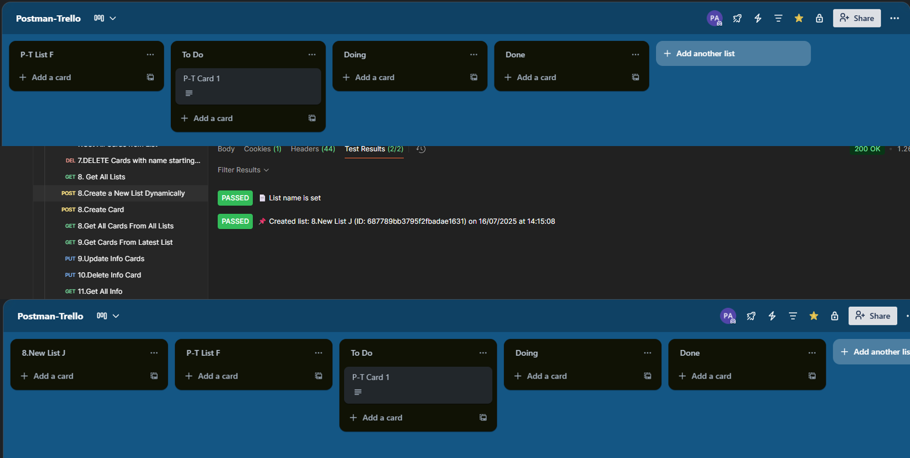

## 14. Create a New List Dynamically

### ✅ Description
This request dynamically creates a new list on the selected board. The list name is generated using a suffix from the environment, allowing automated sequential naming (e.g., 8.New List A, 8.New List B, etc.).

---

### 📤 POST Request
```
https://api.trello.com/1/lists?key={{apiKey}}&token={{apiToken}}
```

---

### 📦 Body (x-www-form-urlencoded)
| Key      | Value           |
|----------|------------------|
| name     | `{{listName}}`   |
| idBoard  | `{{boardId}}`    |
| key      | `{{apiKey}}`     |
| token    | `{{apiToken}}`   |

---

### ⚙️ Pre-request Script
```javascript
// Get current suffix from environment, default to 'A'
let suffix = pm.environment.get("listSuffix") || "A";

// Generate list name
let name = `8.New List ${suffix}`;
pm.environment.set("listName", name);

// Prepare next suffix (B, C, D, ...)
let nextSuffix = String.fromCharCode(suffix.charCodeAt(0) + 1);
pm.environment.set("listSuffix", nextSuffix);
```

---

### 📥 Tests
```javascript
let list = pm.response.json();

// ✅ Check name
pm.test("📄 List name is set", () => {
    pm.expect(list.name).to.include("8.New List");
});

// ✅ Display info
let now = new Date();
let date = now.toLocaleDateString("en-GB");
let time = now.toLocaleTimeString("en-GB");

pm.test(`📌 Created list: ${list.name} (ID: ${list.id}) on ${date} at ${time}`, () => {
    pm.expect(true).to.be.true;
});

// Save ID for later use
pm.environment.set("latestListId", list.id);
```

---

### 🖼️ Result Screenshot


