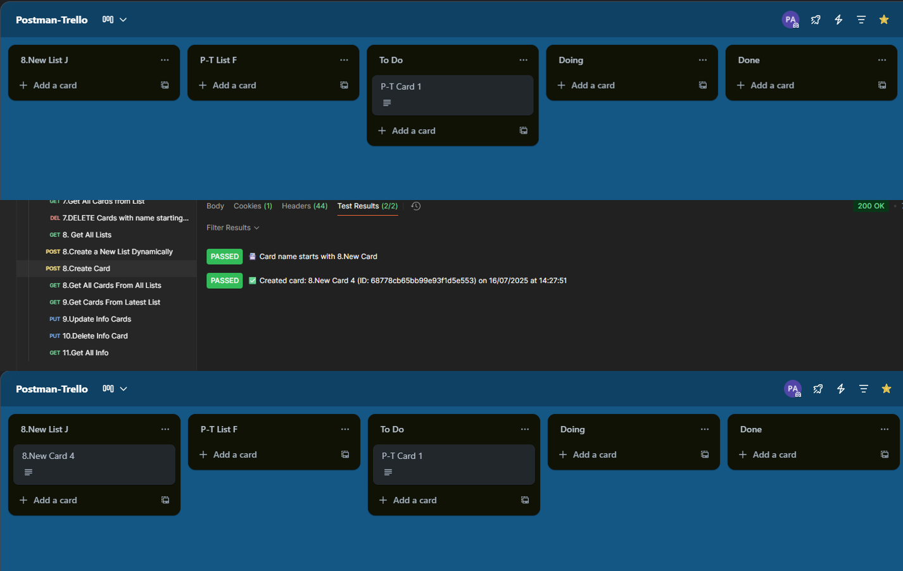

## 15. Create Card

### ✅ Purpose
Creates a new card in an existing list, using a dynamically generated name and a manually set description.

---

### 🔁 Pre-request Script
```javascript
// Get counter or initialize it
let cardCounter = parseInt(pm.environment.get("cardCounter") || "0");

// Build name
let cardName = cardCounter === 0 ? "8.New Card" : `8.New Card ${cardCounter}`;
pm.environment.set("cardName", cardName);

// Increment counter for next time
pm.environment.set("cardCounter", cardCounter + 1);
```

---

### 📤 POST Request

**Endpoint:**
```
https://api.trello.com/1/cards
```

**Body type:** `x-www-form-urlencoded`

| Key   | Value                   |
|-------|-------------------------|
| name  | `{{cardName}}`          |
| idList | `{{latestListId}}`    |
| desc  | Created dynamically from Postman. |
| key   | `{{apiKey}}`            |
| token | `{{apiToken}}`          |

---

### ✅ Tests (Test Results)
```javascript
let card = pm.response.json();

// ✅ Verify name contains prefix
pm.test("📇 Card name starts with 8.New Card", () => {
    pm.expect(card.name).to.include("8.New Card");
});

// ✅ Show card info
let now = new Date();
let date = now.toLocaleDateString("en-GB");
let time = now.toLocaleTimeString("en-GB");

pm.test(`✅ Created card: ${card.name} (ID: ${card.id}) on ${date} at ${time}`, () => {
    pm.expect(true).to.be.true;
});

// Save card ID if needed
pm.environment.set("latestCardId", card.id);
```

---

### 🖼️ Screenshot

