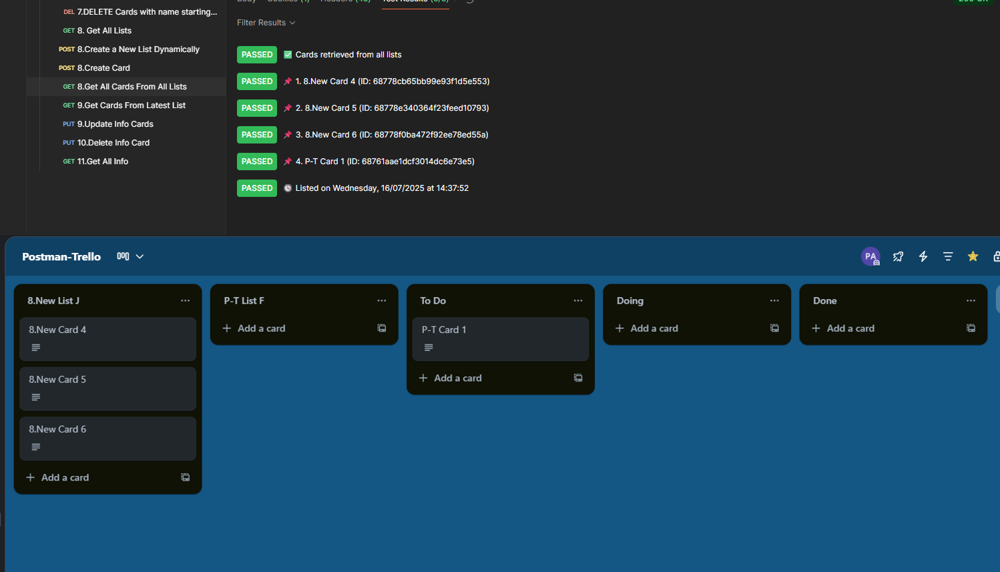

## 16. Get All Cards From All Lists

---

### ✅ Goal
Retrieve **all cards** from every list on the board.

---

### 🔗 API
```
GET https://api.trello.com/1/boards/{{boardId}}/cards?key={{apiKey}}&token={{apiToken}}
```

---

### 🧠 Tests (in `Tests` tab)
```javascript
// ✅ Get all cards from the board
let cards = pm.response.json();

// Check if cards were returned
pm.test("✅ Cards retrieved from all lists", () => {
    pm.expect(Array.isArray(cards)).to.be.true;
});

// ℹ️ Display card name and ID
if (cards.length > 0) {
    cards.forEach((card, index) => {
        const info = `📌 ${index + 1}. ${card.name} (ID: ${card.id})`;
        pm.test(info, () => {
            pm.expect(card.name).to.be.a('string');
            pm.expect(card.id).to.be.a('string');
        });
    });
} else {
    pm.test("ℹ️ No cards found on this board", () => {
        pm.expect(cards.length).to.eql(0);
    });
}

// 🕓 Add timestamp info
let now = new Date();
let day = now.toLocaleDateString("en-GB", { weekday: 'long' });
let date = now.toLocaleDateString("en-GB");
let time = now.toLocaleTimeString("en-GB");

pm.test(`🕓 Listed on ${day}, ${date} at ${time}`, () => {
    pm.expect(true).to.be.true;
});
```

---

### 🖼️ Screenshot

