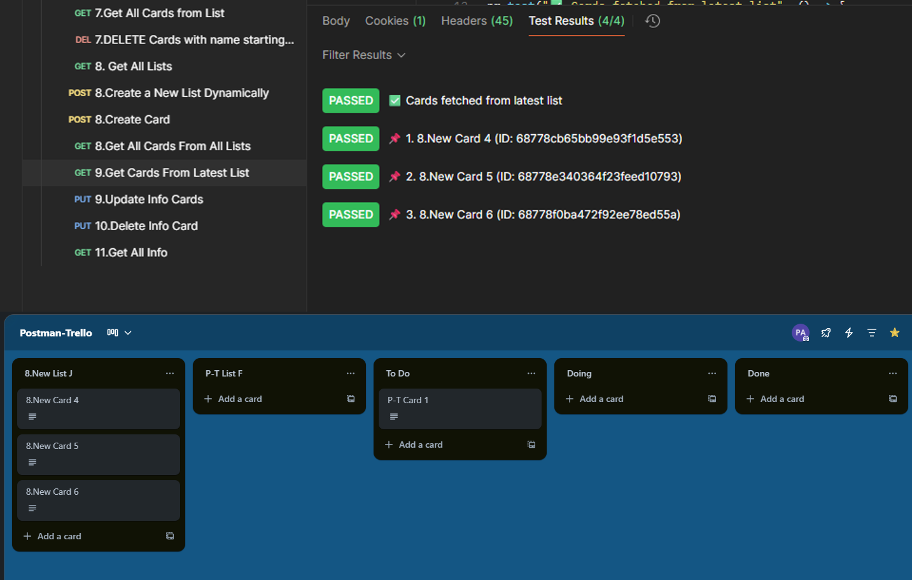

# 🃏 17.Get Cards from Latest List — Test Documentation

This request fetches all cards from the most recently created list in a Trello board and stores their IDs and names for future updates.

---

## ✅ Request

**Method:** `GET`  
**Endpoint:**  
`https://api.trello.com/1/boards/{{boardId}}/lists/{{latestListId}}/cards?key={{apiKey}}&token={{apiToken}}`

---

## ✅ Test Scripts Included

This request extracts all cards from the latest list and saves them into environment variables.

### 📥 Save Data for Update

```javascript
let cards = pm.response.json();

// Save card IDs and names
let ids = cards.map(card => card.id);
let names = cards.map(card => card.name);

// Save to environment
pm.environment.set("cardsToUpdate", JSON.stringify(ids));
pm.environment.set("cardNamesToUpdate", JSON.stringify(names));
pm.environment.set("updateIndex", 0);
```

---

### ✅ Validate Card Retrieval

```javascript
pm.test("✅ Cards fetched from latest list", () => {
    pm.expect(cards.length).to.be.above(0);
});
```

---

### 📌 Display Card Info

```javascript
cards.forEach((card, i) => {
    pm.test(`📌 ${i + 1}. ${card.name} (ID: ${card.id})`, () => {
        pm.expect(card.id).to.be.a("string");
        pm.expect(card.name).to.be.a("string");
    });
});
```

---

## 🌐 Environment Variables Used

| Variable             | Description                              |
|----------------------|------------------------------------------|
| `apiKey`             | Your Trello API Key                      |
| `apiToken`           | Your Trello API Token                    |
| `boardId`            | Trello board ID                          |
| `latestListId`       | ID of the most recently created list     |
| `cardsToUpdate`      | Array of card IDs for update             |
| `cardNamesToUpdate`  | Array of card names                      |
| `updateIndex`        | Current update position                  |

---

## 📸 Visual Results

👉 

---
